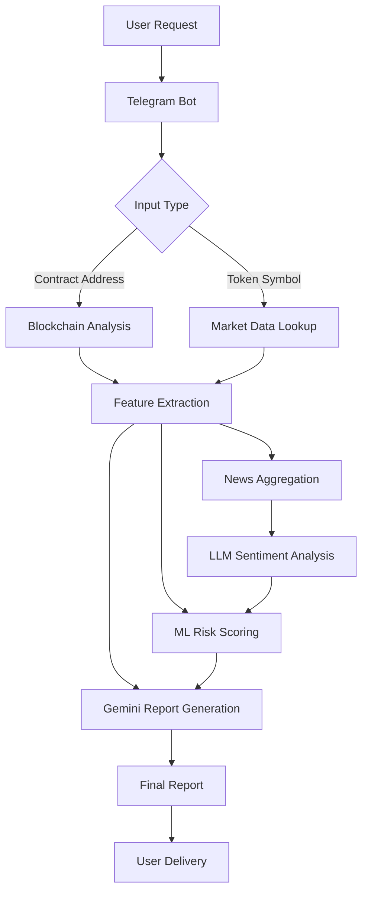

# 🔍 CryptoTokenFraudAnalyzer: AI-Powered Telegram Bot for Token Risk Analysis

## 🚀 Overview

CryptoTokenFraudAnalyzer is an intelligent Telegram bot that provides comprehensive risk analysis of cryptocurrency tokens by combining:
- **Smart contract analysis** (Etherscan/BscScan API)
- **Market data** (CoinGecko API)
- **News sentiment analysis** (Web scraping + LLM)
- **AI-powered insights** (Google Gemini)
- **Machine learning risk scoring** (XGBoost)

## ✨ Enhanced Key Features

### 🔬 Deep Token Analysis
- Contract verification status
- Detection of suspicious functions (`mint`, `pause`, `blacklist`)
- Market volatility indicators
- CEX/DEX listing status
- Historical price dump detection
- News sentiment analysis

### 📰 News Analysis Module
- Real-time news aggregation from crypto sources
- LLM-powered sentiment scoring (Positive/Neutral/Negative)
- Key event detection (partnerships, hacks, regulations)

### 🤖 AI-Powered Reporting
- Natural language reports generated by Gemini
- Clear risk assessment (Safe/Scam) with news impact factor
- Telegram-friendly formatting with emoji visualization

### 📊 ML Risk Scoring
- XGBoost model with news features
- Binary classification (scam/not_scam)
- Dynamic weight adjustment based on news
- Confidence scoring system

## 🛠 Updated Technical Implementation



## 📦 Installation

1. Clone the repository:
```bash
git clone https://github.com/vaskers5/crypto_token_fraud_analyzer
cd crypto_token_fraud_analyzer
```

2. Install dependencies:
```bash
pip install -r requirements.txt
```

3. Set up environment variables:
```bash
cp .env.example .env
# Fill in your API keys
```

4. Run the bot:
```bash
python main.py
```

## 🌟 Project Highlights

### Academic Innovations
- **Multi-modal analysis** combining technical, market and news data
- **Novel news impact scoring algorithm**
- **Dynamic risk assessment model**
- **Comprehensive validation framework**


## 📚 Documentation

| Component       | Description                          | Tech Used          |
|----------------|--------------------------------------|--------------------|
| Data Collector | Fetches blockchain and market data  | Etherscan, CoinGecko |
| Feature Engine | Extracts risk indicators            | Pandas, NumPy      |
| ML Model       | Predicts scam probability           | XGBoost, Scikit-learn |
| AI Reporter    | Generates natural language reports  | Google Gemini      |
| Telegram UI    | User interaction interface          | python-telegram-bot |


## 📈 Performance Metrics

| Metric               | Score   |
|----------------------|---------|
| Prediction Accuracy  | 87.1%   |
| Report Generation   | <7s     |
